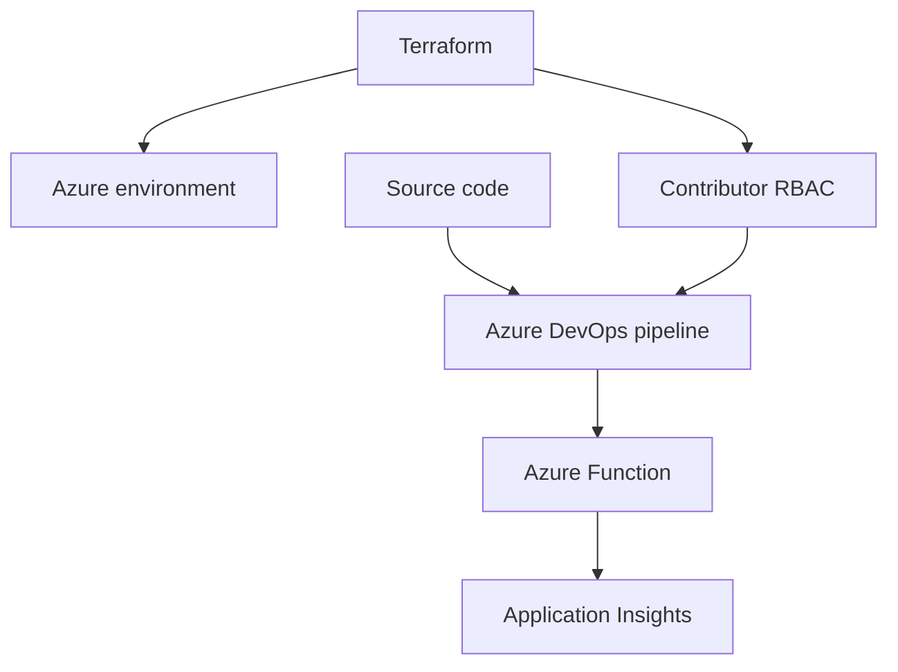
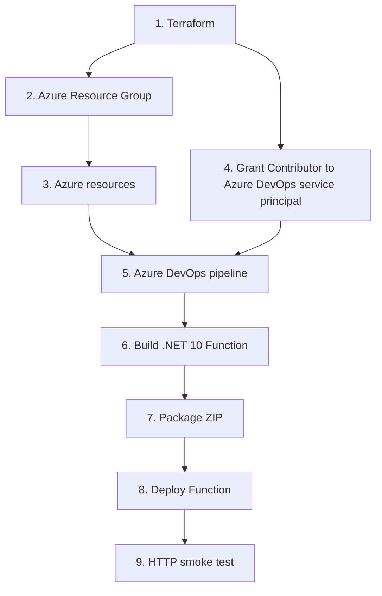
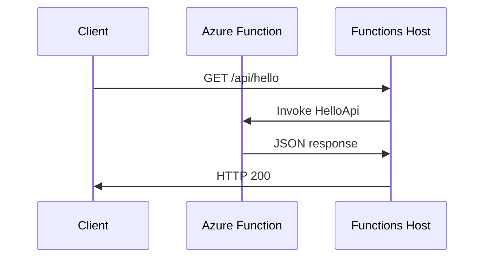
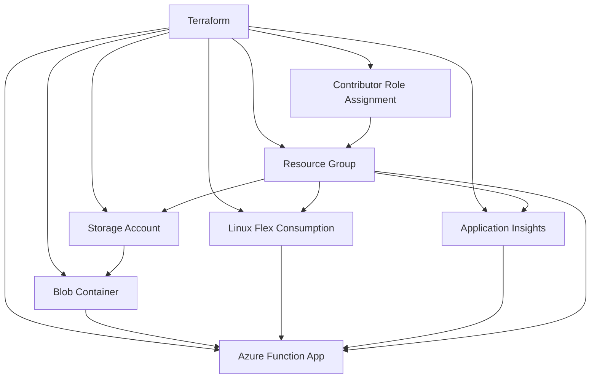
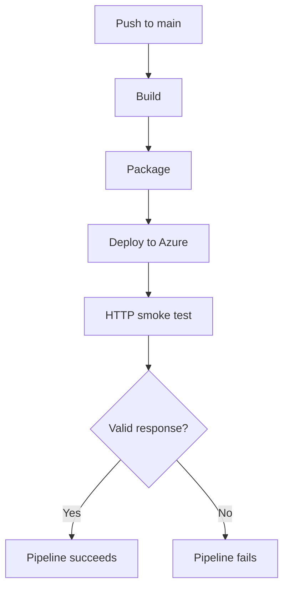
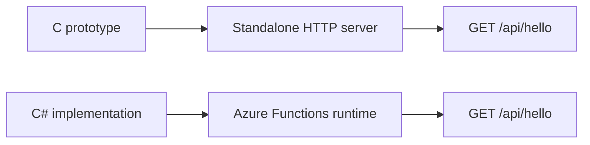

# C# Azure Functions DevOps POC

A small end-to-end DevOps / Platform Engineering proof of concept showing the path from source code to a deployed Azure service using **.NET, Azure Functions, Terraform, Azure DevOps CI/CD, and automated validation**.

The repository also contains a small standalone C HTTP server implementing the same API behavior. It provides a simple reference point for moving from an application-managed HTTP service to a managed serverless runtime.

## What this demonstrates

* .NET 10 isolated Azure Functions
* Azure Functions Flex Consumption on Linux
* Infrastructure as Code with Terraform
* Azure RBAC and service-principal permissions
* Azure DevOps YAML CI/CD
* Automated build, packaging, deployment, and smoke testing
* Application Insights integration
* Separation of infrastructure provisioning from application deployment
* A simple HTTP API with automated post-deployment validation

The application itself is intentionally small. The focus is the **engineering and delivery path around the application**.

---

## Architecture

Terraform provisions the Azure environment and configures the permissions used by Azure DevOps. The pipeline then builds, packages, deploys, and validates the application.



### Provisioning and deployment flow



The separation is intentional:

```text
Terraform
    │
    ├── creates Azure infrastructure
    │
    └── grants Azure DevOps service principal
        access to the resource group

Azure DevOps
    │
    ├── builds the application
    ├── packages the application
    ├── deploys the application
    └── validates the deployed endpoint
```

Infrastructure is therefore established before application deployment, while application releases remain under the CI/CD pipeline.

---

## Application

The service exposes one HTTP endpoint:

```text
GET /api/hello
```

The Azure Function uses the .NET isolated worker model. Azure Functions owns the HTTP listener and runtime lifecycle; the function code focuses on the API behavior.

Request flow:



Expected response:

```json
{
  "message": "Hello from Azure Functions!",
  "service": "hello-api"
}
```

The deployed service can be tested directly:

```bash
% curl -fsS https://helloapifunc-demo.azurewebsites.net/api/hello | jq
{
  "message": "Hello from Azure Functions!",
  "service": "hello-api"
}
```

The same endpoint is called automatically by the Azure DevOps pipeline after deployment.

---

## Infrastructure

Terraform defines the Azure environment rather than relying on manually created portal resources.



The environment includes:

* Azure Resource Group
* Azure Storage Account and blob container
* Linux Flex Consumption service plan
* .NET 10 isolated Azure Function
* System-assigned managed identity
* Application Insights
* Azure RBAC assignment for the Azure DevOps service principal

The infrastructure definition is version-controlled and can be recreated from source.

---

## CI/CD

The Azure DevOps pipeline implements a simple build → package → deploy → validate process.



The pipeline:

1. Installs the .NET 10 SDK
2. Restores NuGet dependencies
3. Builds the Function application
4. Publishes the application
5. Creates a deployment ZIP
6. Publishes the ZIP as a pipeline artifact
7. Deploys it to Azure Functions
8. Calls the deployed HTTP endpoint
9. Verifies the expected service response

Deployment success alone is not considered sufficient. The pipeline validates the running application.

---

## C prototype

`src/HelloApiPrototype/hello-api.c` contains a standalone POSIX C HTTP server implementing the same basic API behavior.

It is included as a reference implementation rather than as another deployment target.



The runtime models are intentionally different:

| C prototype               | C# Azure Function                  |
| ------------------------- | ---------------------------------- |
| Standalone process        | Managed Azure runtime              |
| Creates its own socket    | Azure Functions owns HTTP handling |
| POSIX sockets             | .NET isolated worker               |
| Explicit server lifecycle | Platform-managed lifecycle         |
| Reference implementation  | Deployable cloud service           |

The C implementation is therefore a **behavioral reference**, not a feature-for-feature implementation of the Azure Functions runtime.

---

## Repository structure

```text
.
├── azure-pipelines.yml
├── docker
│   └── Dockerfile
├── Makefile
├── python
│   └── wheelhouse
│       └── .gitkeep
├── README.md
├── src
│   ├── HelloApiFunction
│   │   ├── HelloApiFunction.csproj
│   │   ├── HelloFunction.cs
│   │   ├── Program.cs
│   │   └── host.json
│   └── HelloApiPrototype
│       └── hello-api.c
└── terraform
    └── main.tf
```

Environment-specific configuration files are intentionally excluded from the public repository.

---

## Technology

### Application

* C
* C#
* .NET 10
* Azure Functions isolated worker
* HTTP / JSON

### Azure

* Azure Functions
* Flex Consumption
* Azure Storage
* Application Insights
* Azure RBAC
* Managed Identity

### DevOps

* Azure DevOps
* YAML pipelines
* Git
* Terraform
* Azure CLI

### Development

* VS Code
* Bash
* POSIX sockets
* Linux-compatible tooling

---

## Design decisions

### Infrastructure as Code

Azure resources are defined in Terraform so the environment is reproducible from source instead of being dependent on manual portal configuration.

### Separate infrastructure and application deployment

Terraform establishes the Azure environment and deployment permissions.

Azure DevOps builds and releases the application.

This keeps infrastructure changes separate from application releases.

### Managed runtime

The C prototype represents the traditional model where the application owns the HTTP server and process lifecycle.

The C# implementation delegates those responsibilities to Azure Functions, allowing the application code to focus on the API itself.

### Deployment validation

A successful deployment command does not prove that the deployed application is working.

The pipeline makes an HTTP request against the deployed service and verifies the expected response.

---

## Security

Environment-specific configuration and credentials are not committed to the public repository.

Examples include:

* Terraform variable files containing environment-specific values
* Local Azure Functions settings
* Service credentials
* Access tokens
* API keys
* Private keys

Azure DevOps authenticates to Azure through a service connection and Azure RBAC rather than embedding Azure credentials in the repository.

---

## Running locally

From the Azure Function directory:

```bash
cd src/HelloApiFunction
dotnet restore
dotnet build
func start
```

The local endpoint is:

```text
GET http://localhost:7071/api/hello
```

The C prototype can be built separately with a standard C compiler.

---

## Status

The POC is a working end-to-end delivery path:

```text
Source code
    ↓
Terraform
    ↓
Azure infrastructure
    ↓
Azure DevOps CI/CD
    ↓
Azure Function deployment
    ↓
HTTP smoke test
```

The result is a small but complete example of provisioning, building, deploying, and validating a cloud service through a repeatable DevOps workflow.
