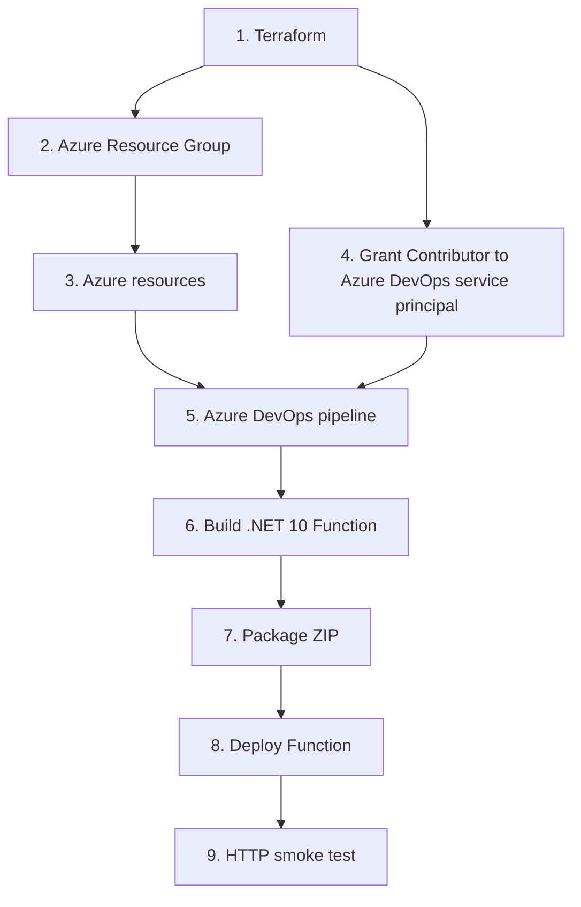
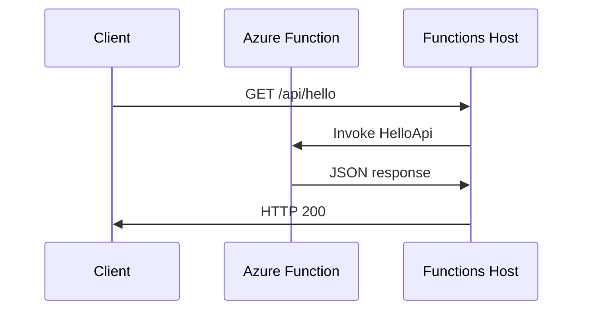
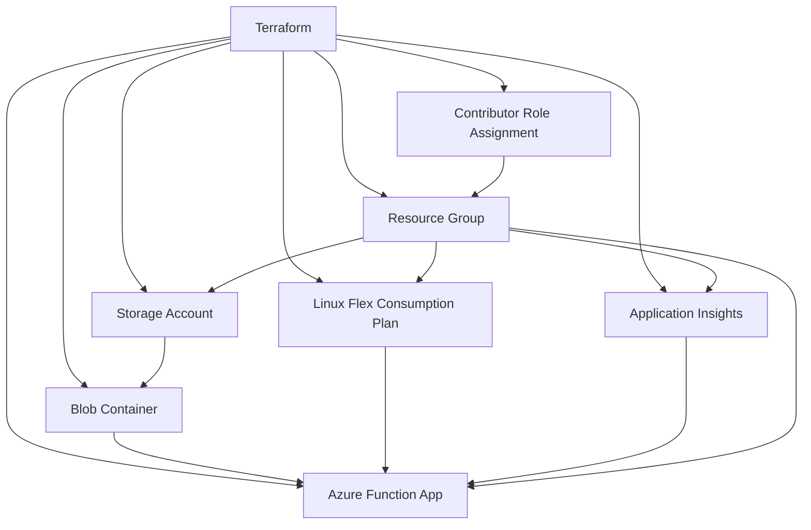
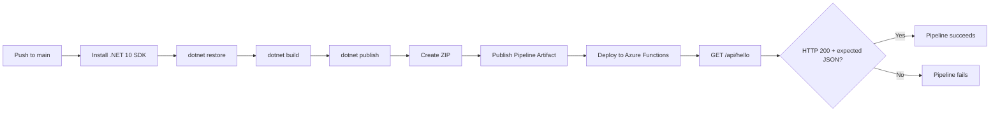
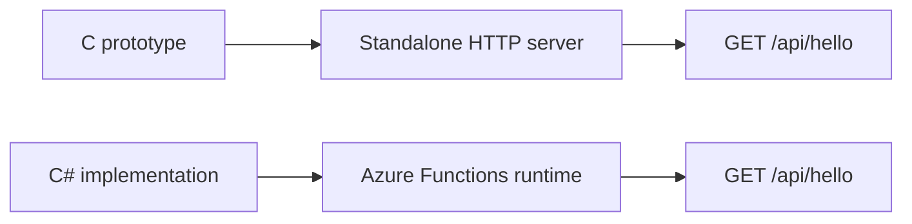
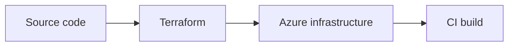

# C# Azure Functions DevOps POC

A small end-to-end DevOps / Platform Engineering proof of concept showing how I take a service from source code to a deployed Azure application using **.NET, Azure Functions, Terraform, Azure DevOps CI/CD, and automated validation**.

The project also contains a small standalone C HTTP implementation of the same API behavior as a reference point for the transition from a traditional service to a managed serverless runtime.

## What this demonstrates

* C to C# / .NET service transition
* .NET 10 isolated Azure Functions
* Azure Functions Flex Consumption on Linux
* Infrastructure as Code with Terraform
* Azure RBAC and service-principal permissions
* Azure DevOps YAML CI/CD
* Automated build, packaging, deployment, and smoke testing
* Application Insights integration
* Separation of infrastructure provisioning from application deployment
* A simple HTTP API with automated post-deployment validation

The goal is not to build a large application. The goal is to demonstrate the **engineering and delivery path around an application**.

---

## Architecture

The environment is provisioned first with Terraform. Terraform creates the Azure resources and grants the Azure DevOps service principal the access to the resource group. The Azure DevOps pipeline then builds and deploys the application into that environment.

```mermaid
flowchart TB
    DEV["Developer"]

    TF["Terraform"]
    RG["Azure Resource Group"]

    RBAC["Azure DevOps Service Principal<br/>Contributor on Resource Group"]

    STORAGE["Azure Storage"]
    PLAN["Linux Flex Consumption"]
    FUNC[".NET 10 Azure Function"]
    AI["Application Insights"]

    PIPE["Azure DevOps Pipeline"]
    APP["GET /api/hello"]

    DEV -->|source changes| PIPE

    TF -->|provisions| RG
    TF -->|grants Contributor| RBAC

    RG --> STORAGE
    RG --> PLAN
    RG --> FUNC
    RG --> AI

    STORAGE --> FUNC
    PLAN --> FUNC

    RBAC -->|authorizes deployment| PIPE

    PIPE -->|build + package + deploy| FUNC
    FUNC --> APP
    FUNC --> AI
```



### Provisioning and deployment flow



The important separation is:

```text
Terraform
    │
    ├── creates Azure infrastructure
    │
    └── grants Azure DevOps service principal
        Contributor access to the resource group

Azure DevOps
    │
    ├── builds the application
    ├── packages the application
    ├── deploys the application
    └── validates the deployed endpoint
```

Terraform therefore establishes the environment **before application deployment**, while Azure DevOps uses the permissions Terraform configured to deploy the application.

### Application flow



Response:

```json
{
  "message": "Hello from Azure Functions!",
  "service": "hello-api"
}
```

---

## Infrastructure

Terraform provisions the Azure environment rather than relying on manually created resources.



The main Azure components are:

* Resource Group
* Storage Account and blob container
* Linux Flex Consumption service plan
* .NET 10 isolated Azure Function
* System-assigned managed identity
* Application Insights
* Azure RBAC assignment for the Azure DevOps service principal

Terraform keeps the infrastructure definition version-controlled and repeatable.

---

## CI/CD

The Azure DevOps pipeline follows a simple build → package → deploy → validate flow.



The pipeline intentionally validates the deployed application rather than stopping after a successful deployment command.

The smoke test checks the deployed endpoint and verifies the expected service response.

---

## Application

The application is deliberately small:

```text
GET /api/hello
```

Expected response:

```json
{
  "message": "Hello from Azure Functions!",
  "service": "hello-api"
}
```

The Azure Function uses the .NET isolated worker model. Azure Functions owns the HTTP listener and runtime lifecycle; the function code focuses on application behavior.

---

## C prototype

`src/HelloApiPrototype/hello-api.c` contains a standalone POSIX C HTTP server implementing the same basic API behavior.



The two implementations are intentionally different at the runtime level:

| C prototype               | C# Azure Function                  |
| ------------------------- | ---------------------------------- |
| Standalone process        | Managed Azure runtime              |
| Creates its own socket    | Azure Functions owns HTTP handling |
| POSIX sockets             | .NET isolated worker               |
| Explicit server lifecycle | Platform-managed lifecycle         |
| Reference implementation  | Deployable cloud service           |

The C implementation is therefore a **behavioral reference**, not a feature-for-feature implementation of the Azure Functions runtime.

---

## Repository structure

```text
.
├── azure-pipelines.yml
├── docker
│   └── Dockerfile
├── Makefile
├── python
│   └── wheelhouse
│       └── .gitkeep
├── README.md
├── src
│   ├── HelloApiFunction
│   │   ├── HelloApiFunction.csproj
│   │   ├── HelloFunction.cs
│   │   ├── Program.cs
│   │   └── host.json
│   └── HelloApiPrototype
│       └── hello-api.c
└── terraform
    └── main.tf
```

Local configuration files containing environment-specific settings are intentionally excluded from source control.

---

## Technology

### Application

* C
* C#
* .NET 10
* Azure Functions isolated worker
* HTTP / JSON

### Azure

* Azure Functions
* Flex Consumption
* Azure Storage
* Application Insights
* Azure RBAC
* Managed Identity

### DevOps

* Azure DevOps
* YAML pipelines
* Git
* Terraform
* Azure CLI

### Development

* Linux-compatible tooling
* VS Code
* Bash
* POSIX sockets

---

## Design decisions

### Infrastructure as Code

Azure resources are defined in Terraform so that the environment can be recreated from source rather than manually configured through the Azure portal.

### Separate infrastructure and application deployment

Terraform creates and configures the Azure environment.

The Azure DevOps pipeline builds and deploys the application.

This keeps infrastructure changes and application releases separate.

### Managed runtime

The C prototype demonstrates the traditional model where the application owns the HTTP server.

The production implementation moves that responsibility to Azure Functions, allowing the application code to focus on the API behavior.

### Deployment validation

A successful deployment command is not treated as proof that the application works.

The pipeline performs an HTTP request against the deployed endpoint and verifies the expected response.

---

## Security considerations

Environment-specific configuration and credentials are not committed to the public repository.

Examples include:

* Terraform variable files containing environment-specific values
* Local Azure Functions settings
* Service credentials
* Access tokens
* API keys
* Private keys

Azure DevOps authenticates to Azure through a service connection and RBAC rather than embedding Azure credentials in the repository.

---

## Running locally

From the Azure Function directory:

```bash
cd src/HelloApiFunction
dotnet restore
dotnet build
func start
```

The local endpoint is:

```text
GET http://localhost:7071/api/hello
```

The C prototype can be built separately with a standard C compiler.

---

## Status

The POC demonstrates the complete path:


